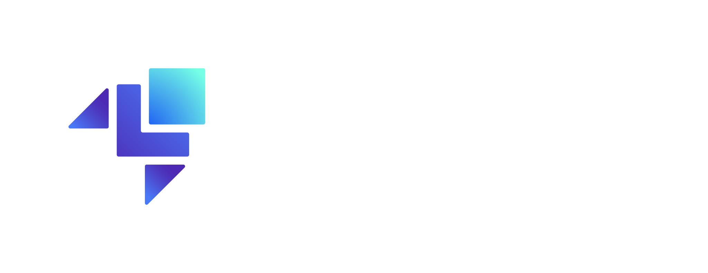

# Running Terraform with Localstack
<div style="display: flex; justify-content: center; gap: 30px;">
  
  
</div>

This repository demonstrates how to set up and run Terraform together with LocalStack for local AWS infrastructure simulation.
> Notice: *LocalStack emulates AWS services locally. However, it is not a full AWS replacement. For example, EC2 is only simulated as metadata (no real VM is created for Hobby Plan)*
> *Do not use LocalStack for commercial purposes under the Hobby plan.*

# Prerequisites
- [LocalStack](https://docs.localstack.cloud/aws/getting-started/installation/) Account (for token)
- [AWS CLI v2](https://docs.aws.amazon.com/cli/latest/userguide/getting-started-install.html)
- [Docker](https://docs.docker.com/engine/install/)
- [Terraform](https://developer.hashicorp.com/terraform/tutorials/aws-get-started/install-cli)

# Folder structure
```
Terraform-with-LocalStack/
├── terraform/
│   ├── main.tf
│   ├── providers.tf
│   ├── variables.tf
│   ├── outputs.tf
│   └── user_data.sh
│
└── <you_app_name>/
    ├── backend/
    │   ├── Dockerfile
    ├── frontend/
	│	└── dist/
```

# Setup
# Configure AWS CLI (fake credentials for LocalStack)
```
aws configure
> AWS ACCESS_KEY: test
> AWS SECRET_ACCESS_KEY: test
> Default region name: us-east-1
> Default output format: json
```

# Setup LocalStack
## Get Localstack Token
Create a Localstack Account then go to https://app.localstack.cloud/getting-started and copy the token
## Start LocalStack
### Options A: Docker run
```
docker run -d -p 4566:4566 -e LOCALSTACK_AUTH_TOKEN=<token> localstack/localstack
```
### Option B: Docker Compose
Store your `LOCALSTACK_AUTH_TOKEN` in an .env file and run docker compose
```
docker compose up --build -d
```
## Verify LocalStack is running
```
docker ps
docker logs <container_id>
```
## Initialize Terraform
```
cd terraform
terraform init
terraform validate
```
## Plan and review changes
```
terraform plan -out=tfplan
```
## Apply Changes
```
terraform apply "tfplan"
```
## Destroy Resources
```
terraform destroy
```

## Stop Localstack
```
docker stop <container_id>
docker rm <container_id>
```

## Checking
In LocalStack, the S3 website endpoint follows the following format: http://<BUCKET_NAME>.s3-website.localhost.localstack.cloud:4566  
### Check if s3 bucket is created
```bash
aws --endpoint-url=http://127.0.0.1:4566 s3 ls
```
### Check if the website loading content
```bash
curl http://<BUCKET_NAME>.s3-website.localhost.localstack.cloud:4566  
```
If this show up html content:
```html
!doctype html>
<html lang="en">
  <head>
    <meta charset="UTF-8" />
    <link rel="icon" type="image/svg+xml" href="/vite.svg" />
    <meta name="viewport" content="width=device-width, initial-scale=1.0" />
    <title>Your Title</title>
    <script type="module" crossorigin src="/assets/index-<...>.js"></script>
    <link rel="stylesheet" crossorigin href="/assets/index-<...>.css">
  </head>
  <body>
    <div id="root"></div>
  </body>
</html>
```
Then you are good

Next, verify if EC2 is running:
### Check EC2 state:
```bash
aws --endpoint-url=http://localhost:4566 ec2 describe-instances --query "Reservations[].Instances[].State.Name"
```
### GET EC2 ID:
```bash
aws --endpoint-url=http://localhost:4566 ec2 describe-instances --query "Reservations[].Instances[].InstanceId"
```

# References
- [Service Docs - https://docs.localstack.cloud/aws/services/](https://docs.localstack.cloud/aws/services/)
- [Reference Tutorial - https://docs.localstack.cloud/aws/tutorials/s3-static-website-terraform/](https://docs.localstack.cloud/aws/tutorials/s3-static-website-terraform/)
